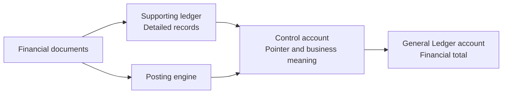

# Control Accounts

A **control account** in Voyzu is a pointer from a supporting ledger to a General Ledger account.

The supporting ledger holds the detailed financial records. The linked General Ledger account holds their financial total in the company ledger. Voyzu uses the control account to connect the two.

Control accounts and the related bank/cash, tax, and inventory accounts are collectively described as **ledger-backed account codes**.

## How the relationship works



The control account is not a second General Ledger account and does not duplicate the detailed ledger. It identifies:

* the supporting ledger the activity belongs to
* the business purpose of the balance
* the General Ledger account to which the financial value is posted

For example, `AP_TRADE_PAYABLES` represents trade payable activity in the Accounts Payable ledger and points to the General Ledger liability account used to hold the total trade payables balance.

## Why control accounts exist

A General Ledger is designed to show financial totals. A supporting ledger explains what makes up those totals.

Without this separation, every supplier bill, customer invoice, inventory movement, or tax movement would need to carry all its operational detail directly in the General Ledger. Control accounts allow the General Ledger to remain financially complete while the supporting ledgers retain the detail needed for allocation, settlement, enquiry, and audit.

The relationship also provides an important integrity check:

```text
Supporting ledger balance = linked General Ledger account balance
```

The comparison must be made for the same company, control-account purpose, date, and accounting basis. A difference indicates that activity is missing, misclassified, or was posted outside the expected route.

## Ledger-backed account types

Voyzu uses the same pointer pattern for several financial areas:

| Supporting ledger | Ledger-backed account | What the detail represents | Typical GL account type |
| --- | --- | --- | --- |
| Accounts Payable | AP control account | Supplier bills, payments, credits, and outstanding supplier balances | Liability |
| Accounts Receivable | AR control account | Customer invoices, receipts, credits, and outstanding customer balances | Asset |
| Bank / Cash | Bank / cash account | Movement and balance for a bank account, cash account, or cash equivalent | Asset or liability |
| Tax | Tax account | Tax charged, recoverable, payable, adjusted, paid, or refunded | Asset or liability |
| Inventory | Inventory control account | Quantity and value movements recorded in the inventory ledger | Asset |

The exact General Ledger classification depends on the purpose of the account. For example, a normal bank account is usually an asset, while an overdrawn account may be represented by a liability account.

## Posting through a control account

When Voyzu processes a financial document, its posting engine resolves the document's posting route. Where that route names a control account, Voyzu follows the pointer to determine the General Ledger account.

A posting normally produces two connected views of the same event:

1. Detailed activity is recorded in the relevant supporting ledger.
2. A journal line is posted to the General Ledger account identified by the control account.

Consider a supplier bill posted to `AP_TRADE_PAYABLES`:

* The Accounts Payable ledger records the supplier, document, due amount, and open balance.
* The control account identifies the trade payables liability account.
* The General Ledger journal credits that liability account for the payable amount.

Paying or crediting the bill updates the supporting ledger and posts the corresponding movement to the same linked General Ledger account. The detailed supplier balances should therefore continue to support the General Ledger total.

## Control-account codes and GL codes

The control-account code and General Ledger code serve different purposes.

* A **control-account code** is a stable business alias used by posting rules, such as `AR_TRADE_RECEIVABLES`.
* A **GL code** identifies the account in the company's chart of accounts, such as `110000`.

Keeping these separate allows an organization or company to retain consistent posting meanings even where its chart-of-accounts codes differ. The Ledger Backed Account Codes report shows each control-account code, its supporting ledger, and the GL account to which it points.

## Organization standards and company records

Control accounts can form part of the organization base settings. A company using those settings follows the organization's control-account-to-GL-account mappings. A company with its own settings maintains its own mappings within its separate chart of accounts.

In either case, financial activity belongs to the company. Control accounts never combine supporting-ledger records or General Ledger balances across companies.

For more about this relationship, see [Organizations and Companies](organizations-and-companies.md).

## Practical principles

* Give each control-account code one clear and stable financial meaning.
* Link it to a GL account with the correct account type and business purpose.
* Route supporting-ledger activity through the control account rather than treating the linked GL account as an unrelated posting destination.
* Avoid changing a mapping after financial activity exists unless the accounting impact has been fully assessed.
* Reconcile supporting-ledger totals to their linked General Ledger accounts regularly.
