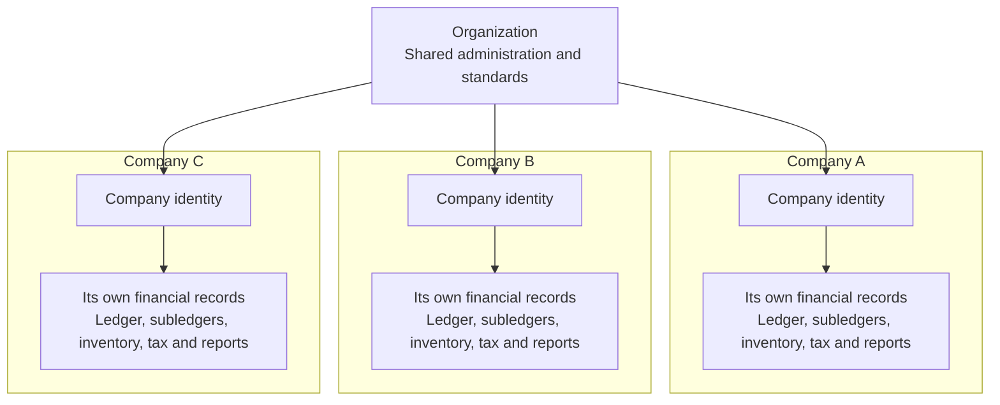

# Organizations and Companies

Within a Voyzu instance there is one **organization** and all companies belong to that one organization. A **company** as an entity with its own financial records.

## The model at a glance

## The organization

The organization is Voyzu's top-level administrative boundary. A Voyzu installation has one organization, created when the environment is set up.

It represents the business, group, or institution operating the environment. The organization provides a common home for:

* companies
* users and access administration
* shared reference data
* standard financial settings that companies can adopt
* organization-wide administration and views of shared setup

The organization does not have a combined ledger of its own. Financial transactions are recorded against a company.

## Companies

A company is the boundary around a distinct set of financial records. Depending on the structure of the organization, a company might represent a legal entity, branch, business unit, fund, or other independently reported operation.

Each company has its own identity and financial context, including its company code, country, base currency, reporting details, and financial calendar.

Most day-to-day activity in Voyzu takes place in the context of a selected company. That context determines which records can be viewed, created, processed, and reported.

## Each company has its own financial records

Company separation applies throughout the accounting model. Each company owns its own:

* financial years and periods
* general ledger accounts, journals, and ledger entries
* accounts receivable and accounts payable records
* counterparties and control accounts
* inventory items and inventory ledger entries
* tax settings and tax ledger entries
* financial documents and posting activity
* dimensions and reporting structures
* company reports and audit history

Records from one company are not part of another company's ledger. A journal, financial document, inventory movement, or subledger entry belongs to one company and is processed within that company's accounting context.

## Deleting a company

Deleting a company permanently removes the company and its company-owned financial records. This includes its ledgers, subledgers, inventory, tax records, reports, settings, and company access assignments.

A company can be deleted even after it has postings. This is not an archival workflow: deactivate a company when its records must be retained but it should no longer be used. Make sure a current backup is available before deleting a company that has financial records.

## Shared standards, separate records

Organization base settings provide a common financial structure for areas such as general ledger accounts, account categories, control accounts, dimensions, and financial document defaults. This avoids repeating common setup and helps companies follow the same accounting conventions.

A company can use these settings in one of two ways:

* **Use organization base settings.** The company is tethered to organization settings. The company uses the organization records as its effective financial setup, so changes made to those base settings flow through to the company.
* **Use company-specific settings.** Voyzu gives the company its own set of settings records based on the organization base settings at that point in time. The company can then change those records independently, and later organization changes do not flow through.

This choice affects financial settings, not financial records. A company using organization base settings still owns its transactions, balances, periods, ledgers, and reports. Shared settings never combine the financial records of different companies.

The choice should be made before the company begins posting financial activity. Once a company has postings, Voyzu prevents changing between organization base settings and company-specific settings because doing so could alter the accounting setup behind existing records.

### Items and item categories

Items and item categories behave differently from the live organization base settings. When a company is created, the organization's items and item categories are copied into that company's own records and are then de-coupled.

The company can change its copies to suit its own operations. Items or categories added, changed, or deactivated later in the organization settings do not automatically change the company's records, and changes made by the company do not flow back to the organization settings.

## Choosing between a company and a dimension

Create a separate company when an operation needs an independently maintained set of books or must be reported as a distinct accounting entity.

Use a dimension or another reporting classification when activity belongs in the same ledger but needs to be analysed by department, project, location, cost centre, or another internal view.

As a rule:

* **Separate books and balances** indicate a company.
* **Different analysis of the same books** indicates a dimension or reporting category.

## Users and company access

Users belong to the organization. Their access can be limited to the companies they are responsible for, allowing one Voyzu environment to support both group-level administration and company-specific access.
