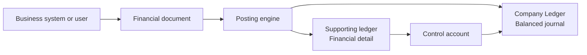

# What is a Financial Ledger?

A financial ledger is the permanent accounting record for a company. It records
the financial effect of transactions as balanced journal entries and provides
the basis for financial statements, enquiries, reconciliation, and audit.

In Voyzu, financial activity enters the ledger through
[financial documents](financial-document-processing.md). A posting engine
validates each document and creates the appropriate Company Ledger and
supporting-ledger entries.



## The Company Ledger

Each company has its own Company Ledger. A journal entry has a header describing
the event and two or more lines that post amounts to General Ledger accounts.
Every posted journal must balance:

```text
Total debits = total credits
```

For example, issuing a customer invoice might produce:

```text
Dr Accounts receivable       1,150.00
  Cr Revenue                 1,000.00
  Cr Tax payable               150.00
```

The ledger records the accounting event. Account balances and financial reports
are calculated from the complete history of these posted movements.

## An immutable record

A posted ledger entry is an immutable record. It is not edited or deleted when
a mistake is found. Corrections are made with a new financial document that
reverses the original financial effect.

A reversal swaps the original debits and credits:

```text
Original
Dr Expense                   1,000.00
  Cr Accrued expenses        1,000.00

Reversal
Dr Accrued expenses          1,000.00
  Cr Expense                 1,000.00
```

The original entry, the correcting entry, and the link between them remain
available. This preserves a complete account of what was posted, when it was
posted, and how it was corrected.

Use the reversal or cancellation document defined for the original transaction.
Do not correct posted accounting history with an update or deletion. If the
correct transaction still needs to be recorded, post it separately after the
reversal.

## Financial, not operational

Voyzu records financial facts rather than operating a company's business
processes. A source system may manage sales, purchasing, collections,
fulfilment, payroll, or banking. It sends the resulting financial events to
Voyzu for accounting.

For example, an accounts receivable invoice records facts needed for the
financial event, including the company, customer, invoice date, amounts,
revenue, tax, and posting treatment. It does not include a due date. Deciding
when payment is expected and managing the collections schedule are company
operations, not part of the financial invoice recorded by Voyzu.

The same boundary applies elsewhere. Voyzu can record the quantity and book
value of inventory without managing warehouses or serial numbers, and it can
record a bank movement without initiating or clearing the bank payment.

Operational identifiers and references can still be supplied so the financial
record can be traced back to its source. That does not turn the ledger into the
system that operates the underlying process.

## Supporting ledgers and subledgers

The Company Ledger is designed to show financially complete account movements
and totals. Supporting ledgers retain the financial detail that explains those
totals.

Voyzu uses supporting ledgers for areas including:

| Supporting ledger | Detail it provides |
| --- | --- |
| Accounts Receivable subledger | Customer invoices, receipts, applications, and outstanding customer balances |
| Accounts Payable subledger | Supplier bills, payments, applications, and outstanding supplier balances |
| Bank / Cash ledger | Financial movements and balances for bank and cash accounts |
| Tax ledger | Tax movements by authority and tax treatment |
| Inventory ledger | Item-level quantity and book-value movements |

The terms **subledger** and **supporting ledger** describe the same general
relationship: detailed financial records support a summarized General Ledger
balance. Accounts Receivable and Accounts Payable are commonly called
subledgers; bank, tax, and inventory are usually described as supporting
ledgers.

A [control account](control-accounts.md) connects a supporting ledger to the
General Ledger account that holds its total. For example, the Accounts
Receivable subledger explains which customer invoices and receipts make up the
Accounts Receivable control-account balance.

```text
Supporting-ledger balance = linked General Ledger account balance
```

The same financial document creates both sides of this relationship. Its
posting engine determines the journal treatment and any supporting-ledger
movements, keeping the detailed and summarized records aligned.

## Core principles

* Every financial event is posted through a financial document.
* Every Company Ledger journal balances.
* Posted records are retained; corrections use reversal or cancellation
  documents.
* Company ledgers are separate and never combine financial records across
  companies.
* Voyzu records financial consequences, not the operational workflow that
  produced them.
* Supporting ledgers explain the balances held in linked General Ledger control
  accounts.
