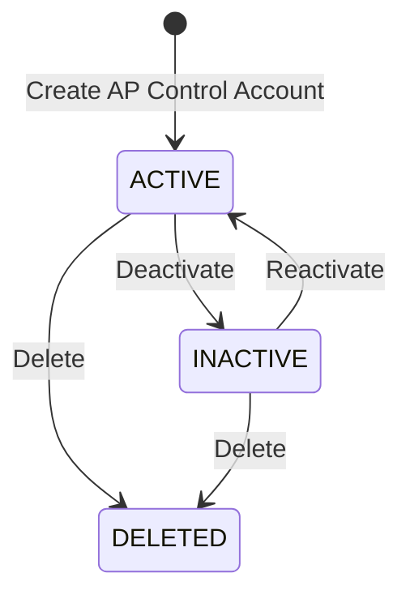

# Organization AP Control Accounts — Domain Data Model (DDM)

***

## 1 Definitions

### 1.1 List of Definitions

**AP control account**  
A general ledger control account used by Accounts Payable processing to represent a defined supplier-related balance.

**Organization standard settings**  
The financial settings maintained against the organization’s template company. These records provide the shared configuration used by linked companies.

**Template company**  
A company record with `is_template = true` that stores the organization’s standard financial settings. Organization AP control accounts are persisted in the same `ap_control_account` table as ordinary company AP control accounts and are distinguished by their owning template company.

**Linked company**  
A non-template company with `use_organization_standard_settings = true`. For configuration purposes, the company resolves AP control accounts from its organization’s template company rather than maintaining an independent set.

**Independent company settings**  
AP control accounts owned directly by a non-template company after it no longer uses organization standard settings. A company with `use_organization_standard_settings = false` resolves its own AP control accounts.

**Effective AP control account**  
The AP control account that applies to a company after resolving whether the company uses organization standard settings or its own settings.

**Control account code**  
A stable business identifier describing the AP accounting purpose of the record, for example `AP_TRADE_PAYABLES` or `AP_UNAPPLIED_PAYMENTS`.

**In use**  
An AP control account is in use when another persisted configuration record, financial document, journal posting, subledger record, or other historical accounting record references it or depends on its code and accounting meaning.

***

## 2 Properties

### 2.1 Properties Matrix

Organization AP control accounts use the same persisted structure as company AP control accounts.

| Property | Type | Required | Unique | Foreign Key | Constraints and Comments |
| --- | --- | --- | --- | --- | --- |
| `company_id` | bigint | yes | composite | `company.id` | Owning template company for organization settings. Forms the primary key with `code`. |
| `code` | business code | yes | composite | — | Stable AP control-account business key. Forms the primary key with `company_id`. |
| `ledger` | text | yes | no | — | Must always be `ACCOUNTS_PAYABLE`. |
| `name` | display name | yes | no | — | Human-readable name for the accounting purpose. |
| `gl_account_id` | bigint | yes | no | `gl_account.id` within the same company | GL account used by this AP control account. The referenced GL account must belong to the same template company. |
| `status` | active status | no | no | — | Indicates whether the control account is available for current configuration and processing. |

System-wide audit and deletion fields are persisted but are not part of the business-domain property matrix.

### 2.2 Additional Property Constraints

| Property | Constraint |
| --- | --- |
| `company_id` | For an organization AP control account, must identify the organization’s template company. |
| `code` | Must be unique within the owning company. It should remain stable after the record is in use. |
| `ledger` | Must equal `ACCOUNTS_PAYABLE`; callers cannot reclassify the record to another ledger. |
| `name` | Must clearly describe the business purpose and must not be relied on as an identifier. |
| `gl_account_id` | Must reference a GL account belonging to the same `company_id`. |
| `status` | An inactive control account cannot be selected for new configuration or new processing, but may remain resolvable for historical records. |

### 2.3 Sub-objects

None.

***

## 3 Relationships

### 3.1 Entity Relationships

#### 3.1.1 Outbound Relationships

- An organization AP control account belongs to exactly one template company through `company_id`.
- The template company belongs to exactly one organization.
- An organization AP control account references exactly one GL account through the composite relationship `(company_id, gl_account_id)`.
- The referenced GL account belongs to the same template company as the AP control account.

#### 3.1.2 Inbound Relationships

- Companies in the same organization may use the template company’s AP control accounts when `use_organization_standard_settings = true`.
- AP financial-document defaults and posting logic may resolve an AP control-account code to an effective AP control account.
- AP financial-document processing may use the resolved GL account when constructing journal postings.
- Historical journals, AP subledger records, reports, and audit records may depend on the control-account code or the GL account selected by it.

### 3.2 Association Rules

- An organization AP control account can only reference a GL account owned by the same template company.
- A linked company does not create a second organization-level AP control-account record. It resolves the record owned by the template company.
- A company with `use_organization_standard_settings = true` must not independently change the organization AP control-account mapping through the company settings surface.
- A company may stop using organization standard settings by changing to independent company settings.
- Once a company uses independent settings, its AP control accounts are separate records owned by that company and subsequent organization changes do not alter them.
- Re-linking a company to organization standard settings changes the source of its effective configuration back to the template company; it does not make company-owned records part of the organization standard.
- The organization/template-company association of an organization AP control account cannot be changed. Moving a record between companies requires creating a new record in the target company context.
- Changing `gl_account_id` changes the organization standard for all currently linked companies and therefore requires organization-level authority.

***

## 4 Lifecycle

### 4.1 Lifecycle Matrix

| From \ To | ACTIVE | INACTIVE | DELETED |
| --- | --- | --- | --- |
| non-existent | Create AP Control Account | — | — |
| ACTIVE | — | Deactivate | Delete |
| INACTIVE | Reactivate | — | Delete |
| DELETED | — | — | — |

### 4.2 Lifecycle Diagram

### 4.3 Lifecycle Operations and Conditions

| Operation | From State | To State | Conditions / Constraints |
| --- | --- | --- | --- |
| Create AP Control Account | non-existent | ACTIVE | Code is unique within the template company; ledger is `ACCOUNTS_PAYABLE`; referenced GL account belongs to the same template company. |
| Change Name | ACTIVE, INACTIVE | unchanged | Must preserve the business meaning represented by the stable code. |
| Change GL Account | ACTIVE | unchanged | New GL account belongs to the same template company; caller has organization-level authority; impact on all linked companies is accepted. |
| Deactivate | ACTIVE | INACTIVE | Record may remain in use historically but cannot be selected for new setup or processing. |
| Reactivate | INACTIVE | ACTIVE | Referenced GL account remains valid and active for its intended use. |
| Delete | ACTIVE, INACTIVE | DELETED | Only when the record is not in use and no linked configuration or historical accounting dependency requires it. |

### 4.4 Lifecycle Guidance

- `ACTIVE` means the AP control account is available to the organization standard and can be resolved for new processing by linked companies.
- `INACTIVE` means the record is retained for history but is not available for new selection or new accounting activity.
- `DELETED` represents logical removal through the standard deletion audit fields. Accounting history must not be made invalid by deletion.
- Changing the GL account is not a lifecycle transition, but it is a high-impact configuration change because it affects the effective settings of every linked company.

***

## 5 Object Rules and Constraints

### 5.1 Object Rules and Conditions

- Every organization AP control account is persisted as an `ap_control_account` row owned by the organization’s template company.
- Organization and company AP control accounts do not use separate tables or separate entity types.
- The combination of `company_id` and `code` uniquely identifies an AP control account.
- `ledger` must always be `ACCOUNTS_PAYABLE`.
- The referenced GL account must belong to the same company as the AP control account.
- A control-account code represents a stable accounting purpose. Changing its name must not change that purpose.
- Organization settings are resolved dynamically through the template company for companies using organization standard settings.
- A linked company must see organization changes without requiring duplicate AP control-account rows to be updated.
- A company that breaks away from organization standard settings must use company-owned AP control-account records thereafter.
- Breaking away must produce an internally complete company configuration; the company must not be left partly dependent on organization AP control accounts unless mixed inheritance is explicitly introduced as a separate domain capability.
- Organization-level changes must not overwrite independent company settings.
- Inactive records remain valid for historical interpretation but cannot be used for new accounting activity.
- A record cannot be deleted while it is in use.
- AP processing must resolve the effective company context before resolving a control-account code to a GL account.
- The default organization AP control-account set includes at least:
  - `AP_TRADE_PAYABLES` — Trade Payables.
  - `AP_UNAPPLIED_PAYMENTS` — Supplier Payments Awaiting Allocation.

***

## 6 Implementation

### 6.1 Database Implementation

- Table: `ap_control_account`.
- Primary key: `(company_id, code)`.
- Organization settings are rows whose `company_id` references a company with `is_template = true`.
- Company linkage to organization standard settings is controlled by `company.use_organization_standard_settings`.
- Template-company identity is controlled by `company.is_template`.
- Organization ownership of the template company is represented by `company.organization_id`.
- The database enforces that the AP control account and referenced GL account share the same `company_id` through the composite foreign key `(company_id, gl_account_id)`.

### 6.2 UI Implementation

- The Organization Financial Settings > AP Control Accounts screen edits records owned by the organization’s template company.
- The screen should present the records as organization standards rather than exposing the template-company implementation detail as the primary concept.
- The code and accounting purpose should be prominent; the selected GL account should show both code and name.
- A GL-account change should warn that the change affects all companies currently using organization standard settings.
- Company users must not edit organization AP control accounts from a company settings screen.
- A company settings screen should clearly indicate whether AP control accounts are inherited from organization settings or independently maintained.
- When a company breaks away, the UI should treat this as an explicit settings-level operation rather than a routine field edit.

### 6.3 Architecture Implementation

- Tenant: organization financial settings / company financial settings.
- Shared module: AP control accounts.
- The same repository and service model may operate against either a template company or a non-template company; the resolved company context determines whether the records are organization standards or independent company settings.
- Consumers should request effective AP control accounts through a resolver rather than assuming the current company ID is always the storage owner.
- Authorization must distinguish organization-level configuration changes from company-level configuration changes.

### 6.4 General Implementation

- Seed organization AP control accounts against template companies.
- Documentation generated from this DDM should describe organization behavior and business rules, not imply that organization settings use a separate persistence model.
- API and UI documentation should preserve the distinction between the stored owner (`company_id`) and the company for which settings are being resolved.
