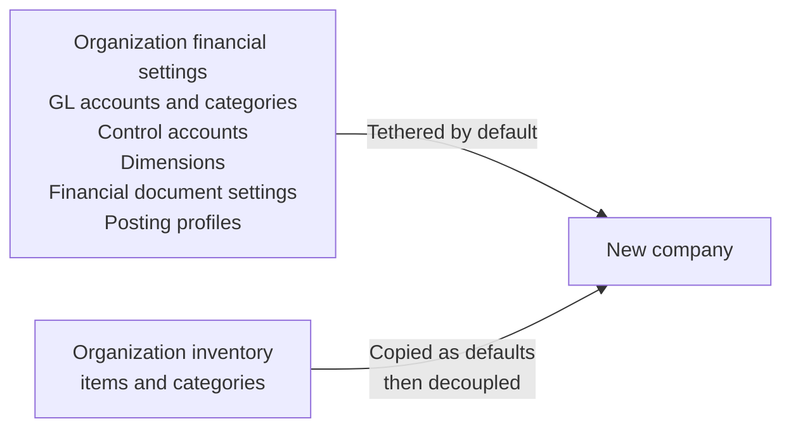

np# Companies

The Companies screen manages the separate financial entities held within the
organization.

## Concepts

Before maintaining companies, understand how Voyzu separates an organization
from the financial records owned by each company:

* [Organizations and Companies](../../concepts/organizations-and-companies.md)
  explains the organization-to-company model, separate company ledgers, and
  organization standard settings.
* [Users and Permissions](../../concepts/users-and-permissions.md) explains which
  users can access all companies and how company users are assigned access.
* [Tax](../../concepts/tax.md) explains the tax settings associated with a
  company's country and filing profile.

## Viewing companies

The Companies list shows each company's code, name, country, base currency,
standard-settings choice, and status.

Use search to match code, name, country, currency, standard-settings choice, or
status. Use **Filter** to narrow the list by:

* Status
* Country
* Whether the company uses organization standard settings

Click anywhere on a company row to open its detail screen. Select a row with
its checkbox to enable the available Activate, Deactivate, and Delete actions.

The toolbar also provides:

* **Refresh** to reload the list.
* **Export selected** for the selected company.
* **Export current view** for the searched and filtered rows.
* **Export full dataset** for every company in the list.

### In use

A company is considered in use once it has financial postings. Its detail
screen displays a **HAS POSTINGS** badge.

Once a company has postings:

* It cannot switch between organization standard settings and company-specific
  settings.
* Its company code should remain unchanged because posted records and external
  integrations identify the company by that code.

These restrictions protect the accounting setup behind existing financial
records. They do not prevent the company from being deactivated or permanently
deleted.

## Create a new company

Click **Add Company** from the Companies list. Supply:

| Field | Purpose |
| --- | --- |
| Code | Stable company identifier used in Voyzu URLs, APIs, and financial documents. Use up to 14 capital letters, numbers, dashes, or underscores. |
| Name | Company name displayed throughout Voyzu and in the company switcher. |
| Country | Determines the base currency, initial financial calendar, and tax-filing defaults. Only active countries are available. |

Click **Create Company** to create the record. Voyzu then opens the company
detail screen so the remaining settings can be reviewed and completed.

The new company's base currency is set to the selected country's currency. It
can be changed later from the company detail screen if required.

Organization financial settings remain linked while **Use Organization Standard
Settings** is enabled. Inventory categories and items follow a different rule:
they are copied into the new company and later organization changes do not flow
through to those company records.

### Creation defaults

A new company is created with:

* Status set to **ACTIVE**.
* **Use Organization Standard Settings** enabled.
* Tax filing anchor month and interval inherited from the selected country.
* Financial years from two years before the current year through five years
  after it. The current financial year's monthly periods are opened.
* Organization inventory items and categories copied into independent company
  records.

Review these defaults before posting financial documents. The standard-settings
choice cannot be changed after the company has postings.

## Make changes

Click a company row to open its detail screen. The screen contains Company
Details, Tax Filing, Report Text, status, posting state, and audit information.

### Company details

The editable company details are:

* Code and name
* Country and base currency
* Organization standard settings

The company code is used by integrations and financial API routes. A code change
requires confirmation because external integrations may also need to be
updated. Make any necessary correction before the company has postings; after
that, treat the code as permanent.

Changing **Use Organization Standard Settings** is a separate confirmed action,
not part of the normal Save operation. The change deletes the company's current
settings and defaults, including its inventory setup, before applying the newly
selected model. It is available only before the company has postings.

### Tax filing

Set the tax-on-sales filing profile with:

* **Anchor Month**, which anchors the filing cycle.
* **Interval**, which can be monthly, every two months, quarterly, half yearly,
  or annually.

The initial values come from the company's country. Confirm them against the
company's actual filing obligations.

### Report text

Use **Report Heading Line 1**, **Report Heading Line 2**, and **Report Footer**
to add company-specific text to generated financial reports. Each field accepts
up to 80 characters.

Click **Save** to apply normal detail changes. Status cannot be edited through
the form; use the dedicated status actions instead.

## Change status

An active company is available in the company switcher and for normal financial
work. An inactive company is retained but is not available for normal access.

Change status from either the Companies list or the company detail screen:

* Select **Activate** to make an inactive company available again.
* Select **Deactivate** to make an active company inaccessible without deleting
  its records.

Deactivation requires confirmation. It does not remove company settings,
ledger entries, reports, or audit history.

## Delete a company

Deletion is permanent and removes the company and its company-owned data. It
cannot be undone.

For a company without financial postings, select **Delete** from the list or
detail screen and confirm that you want to delete it.

For a company with financial postings, the confirmation also warns that its
financial records will be permanently deleted. Make sure you have a current
backup before proceeding.

Deactivate the company instead when its records must be retained but it should
no longer be used.

## See also

* [Organization](organization.md)
* [Financial Periods](../company-ledger/financial-periods.md)
* [Organization Audit Log](audit-log.md)
* [Company Audit Log](../company-ledger/audit-log.md)
* [Control Accounts](../../concepts/control-accounts.md)
